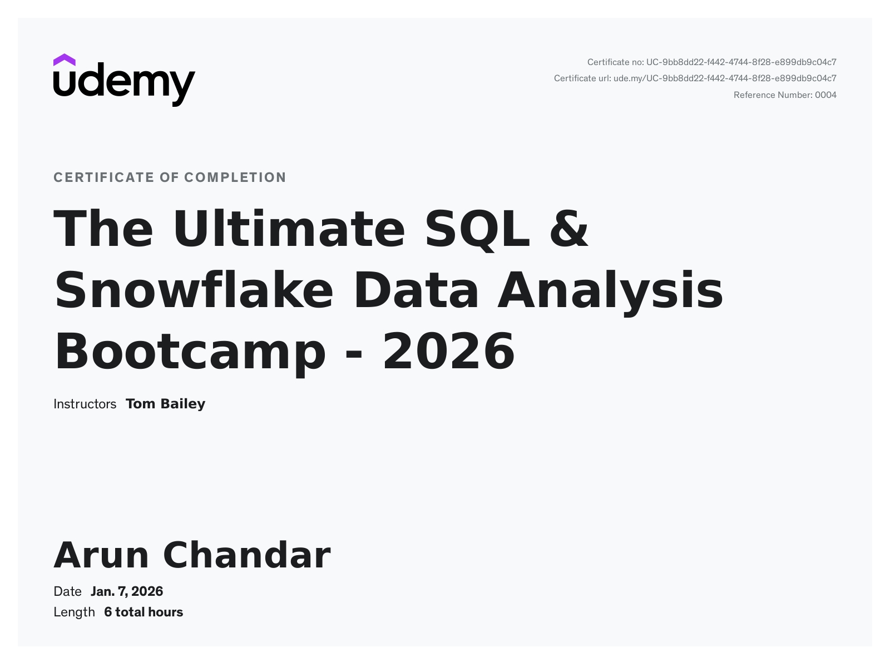
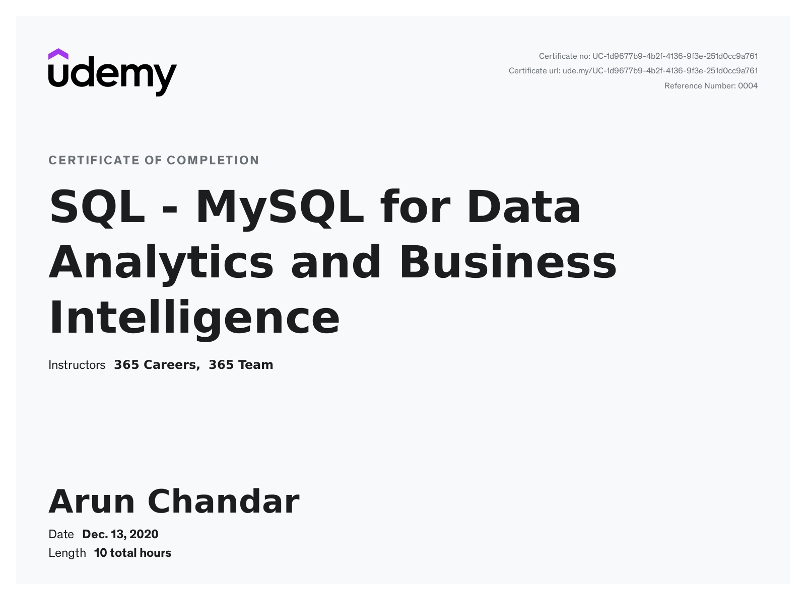
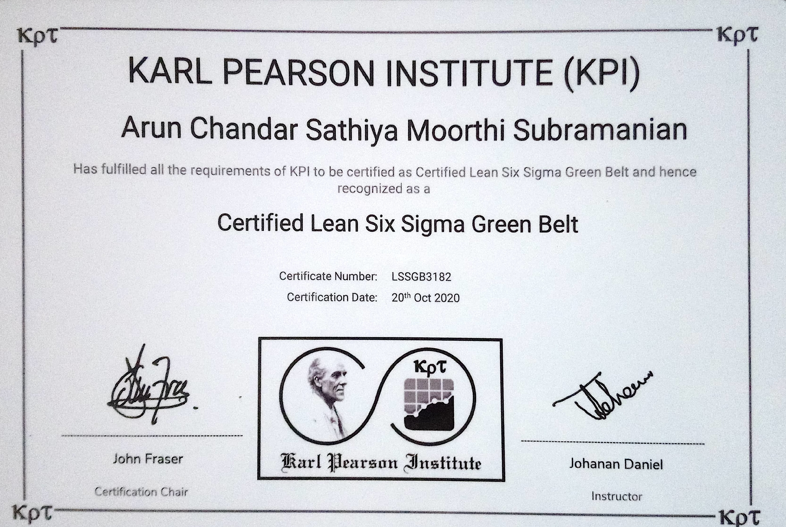

<h1>Hi, I'm Arun 👋</h1>


<h3>BI Analyst | Aspiring Analytics Engineer</h3>

<p><em>Building data pipelines, dashboards, and AI tools</em></p>

<br>

[](mailto:arunchandarac@gmail.com)
[](https://linkedin.com/in/arunchandarac)
[](https://github.com/arunchandar99)
[](https://public.tableau.com/app/profile/arun.chandar/vizzes)

<br clear="both">

---
## 🚀 Journey

**2019-2020 | Continuous Improvement Specialist | SaiSuge Healthcare, India**  
Applied Lean Six Sigma — 60% faster patient flow, 25% revenue increase

**2021-2022 | Business Analyst | Edward-Elmhurst Health, Illinois, USA**  
Optimized Clinical Operations — 14 improvement opportunities, 25% CT lab throughput increase, 17% reduction in cardiac observation stays

**2022-Present | Business Intelligence Analyst | Currency Exchange International, Florida, USA**  
Building BI Infrastructure — own 90%+ of Finance/Compliance reporting, increased data trust & quality (70% reduction in data quality inquiries)

**Next: Analytics Engineer**  
Mastering Snowflake, dbt, modern data pipelines, and AI tools

## 💻 My Stack — From Raw Data to Insight

| **Stage** | **What I Do** | **Tools** |
|-----------|---------------|-----------|
| **Extract & Load** | Pull data from APIs and databases | Python, Snowflake, MySQL |
| **Transform, Model & Validate** | Clean, structure, and test data for analytics | dbt, Tableau Prep, SQL |
| **Visualize & Deliver** | Build dashboards teams actually use | Tableau, Power BI, Excel |
| **Extend & Automate** | Create custom solutions when standard tools fall short | JavaScript, Power Apps, Tableau Extensions |
| **Innovate with AI** | Explore next-gen analytics | Snowflake Cortex, RAG, Vector Embeddings |


## 🎓 Certifications

<table>
<tr>
<td width="150" align="center">

</td>
<td>
<b>Tableau Certified Desktop Specialist</b><br>
<sub>Core Tableau Desktop skills including data connections, calculations, visualizations, and dashboard design</sub>
</td>
</tr>

<tr>
<td width="150" align="center">

</td>
<td>
<b>Tableau Certified Data Analyst</b><br>
<sub>Advanced analytics, statistical functions, complex calculations, and data storytelling in Tableau</sub>
</td>
</tr>

<tr>
<td width="150" align="center">

</td>
<td>
<b>The Ultimate SQL & Snowflake Data Analysis Bootcamp</b><br>
<sub>SQL fundamentals, Snowflake architecture, data warehousing, and analytics on cloud platforms</sub>
</td>
</tr>

<tr>
<td width="150" align="center">

</td>
<td>
<b>SQL for Data Analytics and Business Intelligence</b><br>
<sub>SQL querying, joins, aggregations, subqueries, and database management for analytics</sub>
</td>
</tr>

<tr>
<td width="150" align="center">

</td>
<td>
<b>Lean Six Sigma Green Belt</b><br>
<sub>Process improvement methodologies, DMAIC framework, statistical analysis, and waste reduction</sub>
</td>
</tr>
</table>


## 📂 Repository Directory
```
de-       → Data Engineering & AI Projects
ext-      → Tableau Extensions
app-      → Web Applications
pwr-      → Power Platform Solutions
design-   → UI/UX Design Projects
```
**GitHub Repositories** → [View All](https://github.com/arunchandar99?tab=repositories)

**Visualizations:** All Tableau dashboards live on [**Tableau Public**](https://public.tableau.com/app/profile/arun.chandar/vizzes)

---

<div align="left">

## 👋 Thanks for Stopping By!

If you're interested in analytics engineering, modern data pipelines, or AI-powered BI tools, let's connect!

[](mailto:arunchandarac@gmail.com)
[](https://linkedin.com/in/arunchandarac)
[](https://github.com/arunchandar99)
[](https://public.tableau.com/app/profile/arun.chandar/vizzes)

⭐ Feel free to explore my repositories and reach out!

</div>
